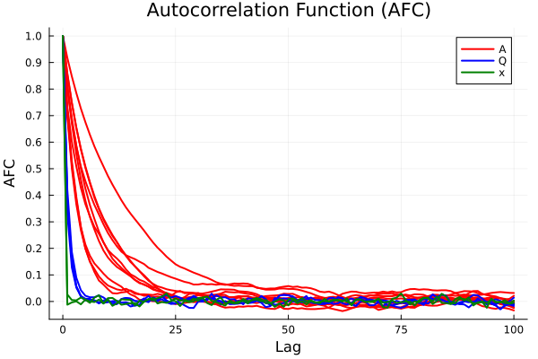
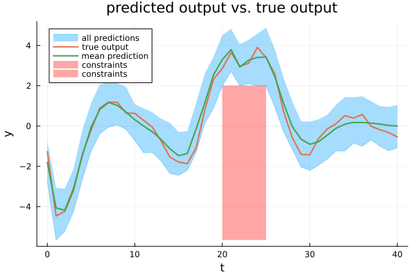

# Julia
[](https://TUM-ITR.github.io/PGopt)

This folder contains the Julia implementation of `PGopt`, which does not require proprietary software. The open-source solver [Altro](https://github.com/RoboticExplorationLab/Altro.jl) is used for the optimization. The results presented in the paper were generated with this version, and the software reproduces these results exactly.

**Please note that this version has several limitations: only cost functions of the form $J_H=\sum\nolimits_{t=0}^H \frac{1}{2} u_t R u_t$, measurement functions of the form $y=x_{1:n_y}$, and output constraints of the form $y_\mathrm{min} \leq y \leq y_\mathrm{max}$ are supported.**

To execute the code, install [Julia](https://julialang.org/). Navigate to this folder, start a Pkg REPL (press `]` in a Julia REPL), and install the dependencies via
```
pkg>activate . 
pkg>instantiate
```

Then execute the scripts `autocorrelation.jl`, `PG_OCP_known_basis_functions.jl`, or `PG_generic_basis_functions.jl` in the folder `examples`.

Tested with Windows 11 and Julia 1.10.

## List of examples
The following examples can be found in the folder [examples](examples).

### autocorrelation.jl
This script reproduces the normalized auto-correlation function plot (Figure 1) in Section V-B of the paper.

<p align = "left">
  
</p>

Assuming knowledge of the basis functions, samples are drawn from the posterior distribution over model parameters and latent state trajectories using the function `particle_Gibbs()` without thinning. Afterward, the autocorrelation is plotted using the function `plot_autocorrelation()`.

The runtime of the script is about 10 minutes on a standard laptop.

### PG_OCP_known_basis_functions.jl
This script reproduces the results of the optimal control approach with known basis functions (Figure 2) given in Section V-B of the paper.

<p align = "left">
  
</p>

```
### Support sub-sample found
Cardinality of the support sub-sample (s): 7
Max. constraint violation probability (1-epsilon): 10.22 %
```

First, the algorithm and simulation parameters are defined, and training data is generated. Then, by calling the function `particle_Gibbs()`, samples are drawn from the posterior distribution using particle Gibbs sampling. These samples are then passed to the function `solve_PG_OCP_greedy_guarantees()`, which solves the scenario OCP and inferres probabilistic constraint satisfaction guarantees by greedily removing constraints and solving the corresponding reduced OCP.

The runtime of the script is about 2 hours on a standard laptop.

For the results in Table II of the paper, this script is repeated with seeds 1:100.

### PG_OCP_generic_basis_functions.jl
This script reproduces the results of the optimal control approach with generic basis functions (Figure 3) given in Section V-C of the paper.

<p align = "left">
  
</p>

The method presented in the paper ["A flexible state–space model for learning nonlinear dynamical systems"](https://doi.org/10.1016/j.automatica.2017.02.030) is utilized to systematically derive basis functions and priors for the parameters based on a reduced-rank GP approximation. Afterward, by calling the function `particle_Gibbs()`, samples are drawn from the posterior distribution using particle Gibbs sampling. These samples are then passed to the function `solve_PG_OCP()`, which solves the scenario OCP.

The runtime of the script is about 2 hours on a standard laptop. Using an improved phi function can reduce the runtime to about 50 minutes, but the results change slightly due to numerical reasons. Further explanations can be found in the source code.

For the results in Table IV of the paper, this script is repeated with seeds 1:100.

## List of source code files
The following files in the folder [src](src) contain the PGopt source code.

### PGopt.jl
Defines the module `PGopt`, which contains the functions defined in `particle_Gibbs.jl` and `optimal_control_Altro.jl`.

### particle_Gibbs.jl
This file contains the particle Gibbs sampler (function `particle_Gibbs()`) and several auxiliary functions that can, for example, be used to test the predictions. 
| Function                | Purpose                                                                                                                                          |
|-------------------------|--------------------------------------------------------------------------------------------------------------------------------------------------|
| particle_Gibbs()        | Run particle Gibbs sampler with ancestor sampling to obtain samples from the joint parameter and state posterior distribution.                   |
| test_prediction()       | Simulate the PGS samples forward in time and compare the predictions to the test data.                                                           |
| plot_predictions()      | Plot the predictions and the test data.                                                                                                          |
| plot_autocorrelation()  | Plot the autocorrelation function (ACF) of the PG samples.                                                                                       |
| systematic_resampling() | Helper function for particle_Gibbs(). Sample indices according to the weights.                                                                   |
| MNIW_sample()           | Helper function for particle_Gibbs(). Sample new model parameters from the distribution conditional on the previously sampled state trajectory. |

Detailed explanations of the individual functions can be found as comments in the file.

### optimal_control_Altro.jl
This file contains all the functions required to solve the scenario OCP and to derive the theoretical guarantees. The solver Altro is used for the optimization. 
| Function                          | Purpose                                                                                                                                                                                                                                                                                                                                                        |
|-----------------------------------|----------------------------------------------------------------------------------------------------------------------------------------------------------------------------------------------------------------------------------------------------------------------------------------------------------------------------------------------------------------|
| solve_PG_OCP()                    | Solve the scenario optimal control problem.                                                                                                                                                                                                                                                                                                                    |
| solve_PG_OCP_greedy_guarantees()  | Solve the scenario optimal control problem and determine a support sub-sample with cardinality s via a greedy constraint removal. Based on the cardinality s, calculate a bound on the probability that the incurred cost exceeds the worst-case cost or that the constraints are violated when the input trajectory u_{0:H} is applied to the unknown system. |
| epsilon()                         | Determine epsilon based on the cardinality s.                                                                                                                                                                                                                                                                                                                  |
| RobotDynamics.discrete_dynamics() | Helper function for solve_PG_OCP().                                                                                                                                                                                                                                                                                                                            |

Detailed explanations of the individual functions can be found as comments in the file.