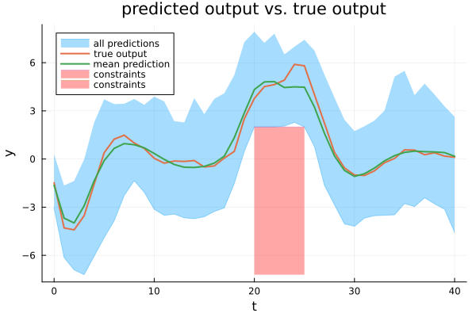

# Optimal control with generic basis functions

This example reproduces the results of the optimal control approach with generic basis functions (Figure 3) given in Section V-C of the [paper](../reference.md).



The method presented in the paper ["A flexible state–space model for learning nonlinear dynamical systems"](https://doi.org/10.1016/j.automatica.2017.02.030) is utilized to systematically derive basis functions and priors for the parameters based on a reduced-rank GP approximation. Afterward, by calling the function `particle_Gibbs()`, samples are drawn from the posterior distribution using particle Gibbs sampling. These samples are then passed to the function `solve_PG_OCP()`, which solves the scenario OCP.

For the results in Table IV of the paper, this script is repeated with seeds 1:100.

A Julia script that contains all the steps described here can be found in the folder `PGopt/Julia/examples`.

The runtime of the script is about 2 hours on a standard laptop. Using an improved function `phi()` can reduce the runtime to about 50 minutes, but the results change slightly due to numerical reasons. Further explanations are given below.

## Define parameters
First, load packages and initialize.
```julia
using PGopt
using LinearAlgebra
using Random
using Distributions
using Printf
using Plots

# Specify seed (for reproducible results).
Random.seed!(82)

# Time PGS algorithm.
sampling_timer = time()
```
Then, specify the parameters of the algorithm.
```julia
# Learning parameters
K = 100 # number of PG samples
k_d = 50 # number of samples to be skipped to decrease correlation (thinning)
K_b = 1000 # length of burn-in period
N = 30 # number of particles of the particle filter

# Number of states, etc.
n_x = 2 # number of states
n_u = 1 # number of control inputs
n_y = 1 # number of outputs
```
## Define basis functions
Then, generate generic basis functions and priors based on a reduced-rank GP approximation.
The approach is described in the paper ["A flexible state–space model for learning nonlinear dynamical systems"](https://doi.org/10.1016/j.automatica.2017.02.030).
The equation numbers given in the following refer to this paper.
```julia
n_phi_x = [5 5] # number of basis functions for each state
n_phi_u = 5 # number of basis functions for the control input
n_phi_dims = [n_phi_u n_phi_x] # array containing the number of basis functions for each input dimension
n_phi = prod(n_phi_dims) # total number of basis functions
l_x = 20
L_x = [l_x l_x] # interval lengths for x
L_u = 10 # interval length for u
L = zeros(1, 1, n_z) # array containing the interval lengths
L[1, 1, :] = [L_u L_x]

# Hyperparameters of the squared exponential kernel
l = [2] # length scale
sf = 100 # scale factor

# Initialize.
j_vec = zeros(n_phi, 1, n_z) # contains all possible vectors j; j_vec[i, 1, :] corresponds to the vector j in eq. (5) for basis function i
lambda = zeros(n_phi, n_z) # lambda[i, :] corresponds to the vector λ in eq. (9) (right-hand side) for basis function i
```
In the following, all possible vectors ``j`` are constructed (i.e., `j_vec`). The possible combinations correspond to the Cartesian product `[1 : n_basis[1]] x ... x [1 : n_basis[end]]`.
```julia
cart_prod_sets = Array{Any}(undef, n_z) # array of arrays; cart_prod_sets[i] corresponds to the i-th set to be considered for the Cartesian product, i.e., [1 : n_basis[i]].
for i = 1:n_z
    cart_prod_sets[i] = Array(1:n_phi_dims[i])
end

subscript_values = Array{Int64}(undef, n_z) # contains the equivalent subscript values corresponding to a given single index i
variants = [1; cumprod(n_phi_dims[1:end-1])] # required to convert the single index i to the equivalent subscript value

# Construct Cartesian product and calculate spectral densities.
for i in 1:n_phi
    # Convert the single index i to the equivalent subscript values.
    remaining = i - 1
    for j in n_z:-1:1
        subscript_values[j] = floor(remaining / variants[j]) + 1
        remaining = mod(remaining, variants[j])
    end

    # Fill j_vec with the values belonging to the respective subscript indices.
    for j in 1:n_z
        j_vec[i, 1, j] = cart_prod_sets[j][subscript_values[j]]
    end

    # Calculate the eigenvalue of the Laplace operator corresponding to the vector j_vec[i, 1, :] - see eq. (9) (right-hand side).
    lambda[i, :] = (pi .* j_vec[i, 1, :] ./ (2 * dropdims(L, dims=tuple(findall(size(L) .== 1)...)))) .^ 2
end

# Reverse j_vec.
j_vec = reverse(j_vec, dims=3)
```
Then, define basis functions phi. This function evaluates ``\phi_{1 : n_x+n_u}`` according to eq. (5).
There are two implementations of the phi function.
### Original implementation
This implementation is the original implementation, which is slow but exactly reproduces the results given in the paper.
```julia
function phi_sampling(x, u)
    # Initialize.
    z = vcat(u, x) # augmented state
    phi = Array{Float64}(undef, n_phi, size(z, 2))

    Threads.@threads for i in axes(z, 2)
        phi_temp = ones(n_phi)
        for k in axes(z, 1)
            phi_temp .= phi_temp .* ((1 ./ (sqrt.(L[:, :, k]))) .* sin.((pi .* j_vec[:, :, k] .* (z[k, i] .+ L[:, :, k])) ./ (2 .* L[:, :, k])))
        end
        phi[:, i] .= phi_temp
    end
    return phi
end
```
### Efficient implementation
After the paper's publication, a much more efficient implementation was found, which, for numerical reasons, produces slightly different results (differences in the range ``1\cdot 10^{-16}`` when called once). 
However, these minimal deviations lead to noticeably different results since the function phi is called recursively ``T \cdot N \cdot K_{\mathrm{total}}`` times (= very often). 
This is the improved implementation, which is significantly faster but yields slightly different results.
```julia
# Precompute.
L_sqrt_inv = 1 ./ sqrt.(L)
pi_j_over_2L = pi .* j_vec ./ (2 .* L)
function phi_sampling(x, u)
    # Initialize.
    z = vcat(u, x) # augmented state
    phi = ones(n_phi, size(z, 2))

    for k in axes(z, 1)
        phi .= phi .* (L_sqrt_inv[:, :, k] .* sin.(pi_j_over_2L[:, :, k] * (z[k, :] .+ L[:, :, k])'))
    end

    return phi
end
```
## Define prior
Select the parameters of the inverse Wishart prior for ``Q``.
```julia
ell_Q = 10 # degrees of freedom
Lambda_Q = 100 * I(n_x) # scale matrix
```
Determine the parameters of the matrix normal prior (with mean matrix ``0``, right covariance matrix ``Q`` (see above), and left covariance matrix ``V``) for ``A``.
``V`` is derived from the GP approximation according to eq. (8b), (11a), and (9).
```julia
V_diagonal = Array{Float64}(undef, size(lambda, 1)) # diagonal of V
for i in axes(lambda, 1)
    V_diagonal[i] = sf^2 * sqrt(opnorm(2 * pi * Diagonal(repeat(l, trunc(Int, n_z / size(l, 1))) .^ 2))) * exp.(-(pi^2 * transpose(sqrt.(lambda[i, :])) * Diagonal(repeat(l, trunc(Int, n_z / size(l, 1))) .^ 2) * sqrt.(lambda[i, :])) / 2)
end
V = Diagonal(V_diagonal)
```
Provide an initial guess for the parameters.
```julia
Q_init = Lambda_Q # initial Q
A_init = zeros(n_x, n_phi) # initial A
```
Choose the distribution of the initial state. Here, a normally distributed initial state is assumed.
```julia
x_init_mean = [2, 2] # mean
x_init_var = 1 * I # variance
x_init_dist = MvNormal(x_init_mean, x_init_var)
```
Define the measurement model. It is assumed to be known (without loss of generality). Make sure that ``g(x, u)`` is defined in vectorized form, i.e., `g(zeros(n_x, N), zeros(n_u, N))` should return a matrix of dimension `(n_y, N)`.
```julia
g(x, u) = [1 0] * x # observation function
R = 0.1 # variance of zero-mean Gaussian measurement noise
```
## Generate data
Generate training data.
```julia
# Parameters for data generation
T = 2000 # number of steps for training
T_test = 500  # number of steps used for testing (via forward simulation - see below)
T_all = T + T_test

# Unknown system
f_true(x, u) = [0.8 * x[1, :] - 0.5 * x[2, :] + 0.1 * cos.(3 * x[1, :]) .* x[2, :]; 0.4 * x[1, :] + 0.5 * x[2,:] + (ones(size(x, 2)) + 0.3 * sin.(2 * x[2, :])) .* u[1, :]] # true state transition function
Q_true = [0.03 -0.004; -0.004 0.01] # true process noise variance
mvn_v_true = MvNormal(zeros(n_x), Q_true) # true process noise distribution
g_true = g # true measurement function
R_true = R # true measurement noise variance
mvn_e_true = MvNormal(zeros(n_y), R_true) # true measurement noise distribution

# Input trajectory used to generate training and test data
mvn_u_training = Normal(0, 3) # training input distribution
u_training = rand(mvn_u_training, T) # training inputs
u_test = 3 * sin.(2 * pi * (1 / T_test) * (Array(1:T_test) .- 1)) # test inputs
u = reshape([u_training; u_test], 1, T_all) # training + test inputs

# Generate data by forward simulation.
x = Array{Float64}(undef, n_x, T_all + 1) # true latent state trajectory
x[:, 1] = rand(x_init_dist, 1) # random initial state
y = Array{Float64}(undef, n_y, T_all) # output trajectory (measured)
for t in 1:T_all
    x[:, t+1] = f_true(x[:, t], u[:, t]) + rand(mvn_v_true, 1)
    y[:, t] = g_true(x[:, t], u[:, t]) + rand(mvn_e_true, 1)
end

# Split data into training and test data.
u_training = u[:, 1:T]
x_training = x[:, 1:T+1]
y_training = y[:, 1:T]

u_test = u[:, T+1:end]
x_test = x[:, T+1:end]
y_test = y[:, T+1:end]
```
## Infer model
Run the particle Gibbs sampler to jointly estimate the model parameters and the latent state trajectory.
```julia
PG_samples = particle_Gibbs(u_training, y_training, K, K_b, k_d, N, phi, Lambda_Q, ell_Q, Q_init, V, A_init, x_init_dist, g, R)

time_sampling = time() - sampling_timer
```
## Define and solve optimal control problem
Afterward, define the optimal control problem of the form

``\min \sum_{t=0}^{H} \frac{1}{2}  u_t  \operatorname{diag}(R_{\mathrm{cost}}) u_t``

subject to:
```math
\begin{aligned}
\forall k, \forall t \\
x_{t+1}^{[k]} &= f_{\theta^{[k]}}(x_t^{[k]}, u_t) + v_t^{[k]} \\
x_{t, 1:n_y}^{[k]} &\geq y_{\mathrm{min},\ t} - e_t^{[k]} \\
x_{t, 1:n_y}^{[k]} &\leq y_{\mathrm{max},\ t} - e_t^{[k]} \\
u_t &\geq u_{\mathrm{min},\ t} \\
u_t &\leq u_{\mathrm{max},\ t}.
\end{aligned}
```

(Note that the output constraints imply the measurement function ``y_t^{[k]} = x_{t, 1:n_y}^{[k]}``.)
```julia
# Horizon
H = 41

# Define constraints for u and y.
u_max = [5] # max control input
u_min = [-5] # min control input
y_max = reshape(fill(Inf, H), (1, H)) # max system output
y_min = reshape([-fill(Inf, 20); 2 * ones(6); -fill(Inf, 15)], (1, H)) # min system output

R_cost_diag = [2] # diagonal of R_cost
```
Solve the optimal control problem. In this case, no formal guarantees for the constraint satisfaction can be derived since Assumption 1 is not satisfied as the employed basis functions cannot represent the actual dynamics with arbitrary precision.
```julia
x_opt, u_opt, y_opt, J_opt, penalty_max = solve_PG_OCP(PG_samples, phi_opt, R, H, u_min, u_max, y_min, y_max, R_cost_diag; K_pre_solve=20, opts=opts)[[1, 2, 3, 4, 8]]
```
Finally, apply the input trajectory to the actual system and plot the output trajectories.
```julia
# Apply input trajectory to the actual system.
y_sys = Array{Float64}(undef, n_y, H)
x_sys = Array{Float64}(undef, n_x, H)
x_sys[:, 1] = x_training[:, end]
u_sys = [u_opt 0]
for t in 1:H
    if t >= 2
        x_sys[:, t] = f_true(x_sys[:, t-1], u_sys[:, t-1]) + rand(mvn_v_true, 1)
    end
    y_sys[:, t] = g_true(x_sys[:, t], u_sys[:, t]) + rand(mvn_e_true, 1)
end

# Plot predictions.
plot_predictions(y_opt, y_sys; plot_percentiles=false, y_min=y_min, y_max=y_max)
```