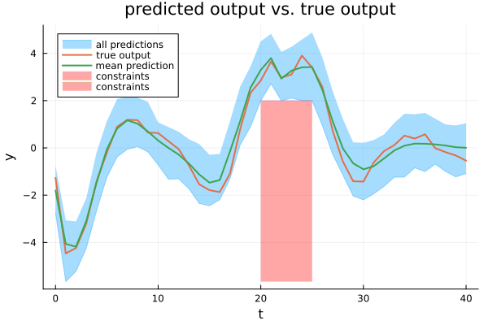

# Optimal control with known basis functions

This example reproduces the results of the optimal control approach with known basis functions (Figure 2) given in Section V-B of the [paper](../reference.md).



```
### Support sub-sample found
Cardinality of the support sub-sample (s): 7
Max. constraint violation probability (1-epsilon): 10.22 %
```

First, the algorithm and simulation parameters are defined, and training data is generated. Then, by calling the function `particle_Gibbs()`, samples are drawn from the posterior distribution using particle Gibbs sampling. These samples are then passed to the function `solve_PG_OCP_Altro_greedy_guarantees()` (or `solve_PG_OCP_Ipopt_greedy_guarantees()` in case IPOPT is used), which solves the scenario OCP using the solver Altro and inferres probabilistic constraint satisfaction guarantees by greedily removing constraints and solving the corresponding reduced OCP.

A Julia script that contains all the steps described in the following and exactly reproduces Figure 2 of the paper can be found at `PGopt/Julia/examples/PG_OCP_known_basis_functions_Altro.jl`. For the results in Table II of the paper, this script is repeated with seeds 1:100. The runtime of the script is about 2 hours on a standard laptop.

A similar example that utilizes the solver IPOPT can be found at `PGopt/Julia/examples/PG_OCP_known_basis_functions_Ipopt.jl`. Due to the different solver, the results differ slightly from the ones presented in the paper.

## Define prior and parameters
First, load packages and initialize.
```julia
using PGopt
using LinearAlgebra
using Random
using Distributions
using Printf
using Plots

# Specify seed (for reproducible results).
Random.seed!(82)

# Time PGS algorithm.
sampling_timer = time()
```
Then, specify the parameters of the algorithm.
```julia
# Learning parameters
K = 200 # number of PG samples
k_d = 50 # number of samples to be skipped to decrease correlation (thinning)
K_b = 1000 # length of burn-in period
N = 30 # number of particles of the particle filter

# Number of states, etc.
n_x = 2 # number of states
n_u = 1 # number of control inputs
n_y = 1 # number of outputs
```
Define the basis functions. The basis functions are assumed to be known in this example. Make sure that ``\phi(x, u)`` is defined in vectorized form, i.e., `phi(zeros(n_x, N), zeros(n_u, N))` should return a matrix of dimension `(n_phi, N)`.
```julia
n_phi = 5 # number of basis functions
phi(x, u) = [0.1 * x[1, :] 0.1 * x[2, :] u[1, :] 0.01 * cos.(3 * x[1, :]) .* x[2, :] 0.1 * sin.(2 * x[2, :]) .* u[1, :]]' # basis functions
```
Select the parameters of the inverse Wishart prior for ``Q``.
```julia
ell_Q = 10 # degrees of freedom
Lambda_Q = 100 * I(n_x) # scale matrix
```
Select the parameters of the matrix normal prior (with mean matrix ``0``, right covariance matrix ``Q`` (see above), and left covariance matrix ``V``) for ``A``.
```julia
V = Diagonal(10 * ones(n_phi)) # left covariance matrix
```
Provide an initial guess for the parameters.
```julia
Q_init = Lambda_Q # initial Q
A_init = zeros(n_x, n_phi) # initial A
```
Choose the distribution of the initial state. Here, a normally distributed initial state is assumed.
```julia
x_init_mean = [2, 2] # mean
x_init_var = 1 * I # variance
x_init_dist = MvNormal(x_init_mean, x_init_var)
```
Define the measurement model. It is assumed to be known (without loss of generality). Make sure that ``g(x, u)`` is defined in vectorized form, i.e., `g(zeros(n_x, N), zeros(n_u, N))` should return a matrix of dimension `(n_y, N)`.
```julia
g(x, u) = [1 0] * x # observation function
R = 0.1 # variance of zero-mean Gaussian measurement noise
```
## Generate data
Generate training data.
```julia
# Parameters for data generation
T = 2000 # number of steps for training
T_test = 500 # number of steps used for testing (via forward simulation - see below)
T_all = T + T_test

# Unknown system
f_true(x, u) = [0.8 * x[1, :] - 0.5 * x[2, :] + 0.1 * cos.(3 * x[1, :]) .* x[2, :]; 0.4 * x[1, :] + 0.5 * x[2,:] + (ones(size(x, 2)) + 0.3 * sin.(2 * x[2, :])) .* u[1, :]] # true state transition function
Q_true = [0.03 -0.004; -0.004 0.01] # true process noise variance
mvn_v_true = MvNormal(zeros(n_x), Q_true) # true process noise distribution
g_true = g # true measurement function
R_true = R # true measurement noise variance
mvn_e_true = MvNormal(zeros(n_y), R_true) # true measurement noise distribution

# Input trajectory used to generate training and test data
mvn_u_training = Normal(0, 3) # training input distribution
u_training = rand(mvn_u_training, T) # training inputs
u_test = 3 * sin.(2 * pi * (1 / T_test) * (Array(1:T_test) .- 1)) # test inputs
u = reshape([u_training; u_test], 1, T_all) # training + test inputs

# Generate data by forward simulation.
x = Array{Float64}(undef, n_x, T_all + 1) # true latent state trajectory
x[:, 1] = rand(x_init_dist, 1) # random initial state
y = Array{Float64}(undef, n_y, T_all) # output trajectory (measured)
for t in 1:T_all
  x[:, t+1] = f_true(x[:, t], u[:, t]) + rand(mvn_v_true, 1)
  y[:, t] = g_true(x[:, t], u[:, t]) + rand(mvn_e_true, 1)
end

# Split data into training and test data.
u_training = u[:, 1:T]
x_training = x[:, 1:T+1]
y_training = y[:, 1:T]

u_test = u[:, T+1:end]
x_test = x[:, T+1:end]
y_test = y[:, T+1:end]
```
## Infer model
Run the particle Gibbs sampler to jointly estimate the model parameters and the latent state trajectory.
```julia
PG_samples = particle_Gibbs(u_training, y_training, K, K_b, k_d, N, phi, Lambda_Q, ell_Q, Q_init, V, A_init, x_init_dist, g, R)

time_sampling = time() - sampling_timer
```
## Define and solve optimal control problem using Altro
In the following, the optimal control problem is defined and solved using the solver Altro. An example using the solver IPOPT is given in the next section.
With the Altro solver, problems of the following form can be solved

``\min \sum_{t=0}^{H} \frac{1}{2} u_t \operatorname{diag}(R_{\mathrm{cost}}) u_t``

subject to:
```math
\begin{aligned}
\forall k, \forall t \\
x_{t+1}^{[k]} &= f_{\theta^{[k]}}(x_t^{[k]}, u_t) + v_t^{[k]} \\
x_{t, 1:n_y}^{[k]} &\geq y_{\mathrm{min},\ t} - e_t^{[k]} \\
x_{t, 1:n_y}^{[k]} &\leq y_{\mathrm{max},\ t} - e_t^{[k]} \\
u_t &\geq u_{\mathrm{min},\ t} \\
u_t &\leq u_{\mathrm{max},\ t}.
\end{aligned}
```

(Note that the output constraints imply the measurement function ``y_t^{[k]} = x_{t, 1:n_y}^{[k]}``.)
```julia
# Horizon
H = 41

# Define constraints for u and y.
u_max = [5] # max control input
u_min = [-5] # min control input
y_max = reshape(fill(Inf, H), (1, H)) # max system output
y_min = reshape([-fill(Inf, 20); 2 * ones(6); -fill(Inf, 15)], (1, H)) # min system output

R_cost_diag = [2] # diagonal of R_cost
```
Select the confidence parameter for the theoretical guarantees.
```julia
β = 0.01
```
Solve the optimal control problem using the solver Altro and determine a support sub-sample with cardinality ``s`` via a greedy constraint removal. 
Based on the cardinality ``s``, a bound on the probability that the incurred cost exceeds the worst-case cost or that the constraints are violated when the input trajectory ``u_{0:H}`` is applied to the unknown system is calculated (i.e., ``1-\epsilon`` is determined).
```julia
u_opt, x_opt, y_opt, J_opt, s, epsilon_prob, epsilon_perc, time_first_solve, time_guarantees, num_failed_optimizations = solve_PG_OCP_Altro_greedy_guarantees(PG_samples, phi, R, H, u_min, u_max, y_min, y_max, R_cost_diag, β; K_pre_solve=20)
```
Finally, apply the input trajectory to the actual system and plot the output trajectories.
```julia
# Apply input trajectory to the actual system.
y_sys = Array{Float64}(undef, n_y, H)
x_sys = Array{Float64}(undef, n_x, H)
x_sys[:, 1] = x_training[:, end]
u_sys = [u_opt 0]
for t in 1:H
  if t >= 2
    x_sys[:, t] = f_true(x_sys[:, t-1], u_sys[:, t-1]) + rand(mvn_v_true, 1)
  end
  y_sys[:, t] = g_true(x_sys[:, t], u_sys[:, t]) + rand(mvn_e_true, 1)
end

# Plot predictions.
plot_predictions(y_opt, y_sys; plot_percentiles=false, y_min=y_min, y_max=y_max)
```

## Define and solve optimal control problem using Ipopt
Besides the solver Altro, IPOPT can be used to solve the OCP. The solver IPOPT is more general than Altro, and this implementation allows arbitrary cost functions ``J_H(u_{1:H},x_{1:H},y_{1:H})``, measurement functions ``y=g(x,u)``, and constraints ``h(u_{1:H},x_{1:H},y_{1:H})``.

First, load the necessary packages. 
```julia
using JuMP
import HSL_jll # requires a proprietary license
```
Then, set up the OCP.
```julia
# Set up OCP.
# Horizon
H = 41

# Define constraints for u.
u_max = repeat([5], 1, H) # max control input
u_min = repeat([-5], 1, H) # min control input
n_input_const = sum(isfinite.(u_min)) + sum(isfinite.(u_max))

# Define constraints for y.
y_max = reshape(fill(Inf, H), (1, H)) # max system output
y_min = reshape([-fill(Inf, 20); 2 * ones(6); -fill(Inf, 15)], (1, H)) # min system output
n_output_const = sum(isfinite.(y_min)) + sum(isfinite.(y_max))
```
The following functions define the input and output constraints. The function `bounded_input()` returns the constraint vector ``h_1(u_{1:H})`` and the function `bounded_output()` returns the constraint vector ``h_2(u_{1:H},x_{1:H}^{[k]},y_{1:H}^{[k]})``. Feasible solutions must satisfy ``h_1(u_{1:H}) \leq 0`` and ``h_2(u_{1:H},x_{1:H}^{[k]},y_{1:H}^{[k]}) \leq 0 \; \forall k``. The functions should be callable with arrays of type `VariableRef` and `<:Number`.
```julia
function bounded_input(u::Array{VariableRef})
  # Initialize constraint vector.
  h_u = Array{AffExpr}(undef, n_input_const)

  # Construct constraint vector - constraints are only considered if they are finite.
  i = 1
  for t in 1:H
    for n in 1:n_u
      if isfinite(u_min[n, t])
        h_u[i] = u_min[n, t] - u[n, t]
        i += 1
      end
      if isfinite(u_max[n, t])
        h_u[i] = u[n, t] - u_max[n, t]
        i += 1
      end
    end
  end
  return h_u
end

function bounded_input(u::Array{<:Number})
  # Initialize constraint vector.
  h_u = Array{Float64}(undef, n_input_const)

  # Construct constraint vector - constraints are only considered if they are finite.
  i = 1
  for t in 1:H
    for n in 1:n_u
      if isfinite(u_min[n, t])
        h_u[i] = u_min[n, t] - u[n, t]
        i += 1
      end
      if isfinite(u_max[n, t])
        h_u[i] = u[n, t] - u_max[n, t]
        i += 1
      end
    end
  end
  return h_u
end

function bounded_output(u::Array{VariableRef}, x::Array{VariableRef}, y::Array{VariableRef})
  # Initialize constraint vector.
  h_scenario = Array{AffExpr}(undef, n_output_const)

  # Construct constraint vector - constraints are only considered if they are finite.
  i = 1
  for t in 1:H
    for n in 1:n_y
      if isfinite(y_min[n, t])
        h_scenario[i] = y_min[n, t] - y[n, t]
        i += 1
      end
      if isfinite(y_max[n, t])
        h_scenario[i] = y[n, t] - y_max[n, t]
        i += 1
      end
    end
  end
  return h_scenario
end

function bounded_output(u::Array{<:Number}, x::Array{<:Number}, y::Array{<:Number})
  # Initialize constraint vector.
  h_scenario = Array{Float64}(undef, n_output_const)

  # Construct constraint vector - constraints are only considered if they are finite.
  i = 1
  for t in 1:H
    for n in 1:n_y
      if isfinite(y_min[n, t])
        h_scenario[i] = y_min[n, t] - y[n, t]
        i += 1
      end
      if isfinite(y_max[n, t])
        h_scenario[i] = y[n, t] - y_max[n, t]
        i += 1
      end
    end
  end
  return h_scenario
end
```
Define the cost function. In this case the objective is ``\min \sum_{t=0}^{H} u_t^2``.
```julia
function cost_function(u) 
  cost = sum(u.^2)
  return cost
end
```
Then, set the solver's options. The option `"linear_solver" => "ma57"` requires the proprietary [HSL Linear Solvers for Julia](https://licences.stfc.ac.uk/product/libhsl).
```julia
Ipopt_options = Dict("max_iter" => 10000, "tol" => 1e-8, "hsllib" => HSL_jll.libhsl_path, "linear_solver" => "ma57")
```
Select the confidence parameter for the theoretical guarantees.
```julia
β = 0.01
```
Solve the optimal control problem using the solver IPOPT and determine a support sub-sample with cardinality ``s`` via a greedy constraint removal. 
Based on the cardinality ``s``, a bound on the probability that the incurred cost exceeds the worst-case cost or that the constraints are violated when the input trajectory ``u_{0:H}`` is applied to the unknown system is calculated (i.e., ``1-\epsilon`` is determined).
Since the cost function depends only on the control inputs ``u_{0:H}``, the optional argument `J_u` is set to `true`.
```julia
u_opt, x_opt, y_opt, J_opt, s, epsilon_prob, epsilon_perc, time_first_solve, time_guarantees, num_failed_optimizations = solve_PG_OCP_Ipopt_greedy_guarantees(PG_samples, phi, g, R, H, cost_function, bounded_output, bounded_input, β; J_u=true, K_pre_solve=5, solver_opts=copy(Ipopt_options))
```
Finally, apply the input trajectory to the actual system and plot the output trajectories.
```julia
# Apply input trajectory to the actual system.
y_sys = Array{Float64}(undef, n_y, H)
x_sys = Array{Float64}(undef, n_x, H)
x_sys[:, 1] = x_training[:, end]
u_sys = [u_opt 0]
for t in 1:H
  if t >= 2
    x_sys[:, t] = f_true(x_sys[:, t-1], u_sys[:, t-1]) + rand(mvn_v_true, 1)
  end
  y_sys[:, t] = g_true(x_sys[:, t], u_sys[:, t]) + rand(mvn_e_true, 1)
end

# Plot predictions.
plot_predictions(y_opt, y_sys; plot_percentiles=false, y_min=y_min, y_max=y_max)
```