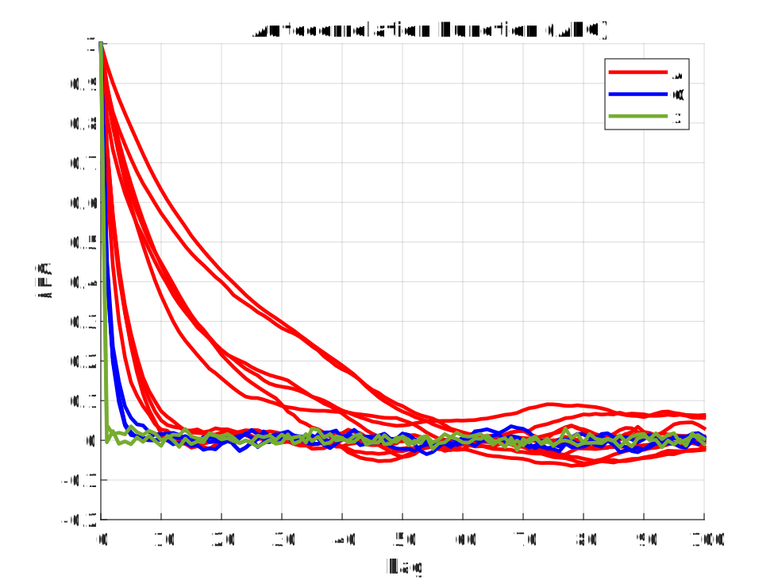
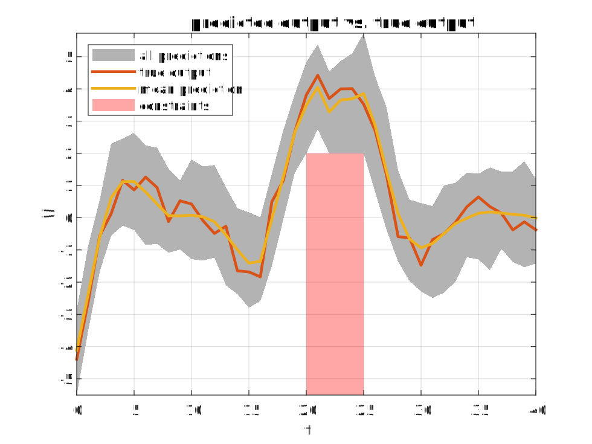
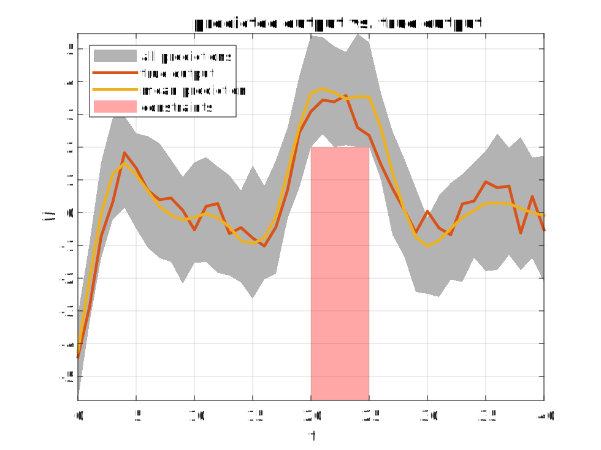

# MATLAB
This folder contains the MATLAB implementation of `PGopt` which uses [CasADi](https://web.casadi.org/), [IPOPT](https://coin-or.github.io/Ipopt/), and the proprietary [HSL Linear Solvers](https://licences.stfc.ac.uk/product/coin-hsl) to solve the scenario optimal control problem.

**Note that the results presented in the paper were obtained using the Julia version. Although the MATLAB version provides similar results, it does not reproduce these results exactly due to different random numbers in Matlab and Julia.**

To execute the MATLAB code, first install [MATLAB](https://mathworks.com/products/matlab.html). 

Then, install the proprietary [HSL Linear Solvers](https://licences.stfc.ac.uk/product/coin-hsl). You can find detailed instructions for the installation [here](HSL_install_instructions.md). Executing the code without the HSL Linear Solvers may be possible, but this is not recommended due to the long runtime. In this case, change the *'linear_solver'* option in the struct solver_opts, e.g., to *"mumps"*.

Finally, download [CasADi](https://web.casadi.org/get/) and unzip the source code. Afterward, add the CasADi directory to the MATLAB path by editing the command
```
addpath('<yourpath>/casadi-3.6.5-windows64-matlab2018b')
```
at the beginning of the MATLAB scripts `PG_OCP_known_basis_functions.m`and `PG_generic_basis_functions.m`.

Then, execute the scripts `autocorrelation.m`, `PG_OCP_known_basis_functions.m`, or `PG_generic_basis_functions.m`.

Tested with Windows 11 and MATLAB R2021b.

## List of scripts

### autocorrelation.m
This script produces a normalized auto-correlation function plot similar to the one given in Section V-B (Fig. 1) of the paper.

<p align = "left">
  
</p>

Assuming knowledge of the basis functions, samples are drawn from the posterior distribution over model parameters and latent state trajectories using the function `particle_Gibbs()` without thinning. Afterward, the autocorrelation is plotted using the function `plot_autocorrelation()`.

The runtime of the script is about 15 minutes on a standard laptop.

### PG_OCP_known_basis_functions.m
This script produces results for the optimal control approach with known basis functions similar to the ones given in Section V-B (Fig. 2) of the paper.

<p align = "left">
  
</p>

```
### Support sub sample found
Cardinality of the support sub-sample (s): 8
Max. constraint violation probability (1-epsilon): 11.00 %
```

First, the algorithm and simulation parameters are defined, and training data is generated. Then, by calling the function `particle_Gibbs()`,  samples are drawn from the posterior distribution using particle Gibbs sampling. These samples are then passed to the function `solve_PG_OCP_greedy_guarantees()`, which solves the scenario OCP and inferres probabilistic constraint satisfaction guarantees by greedily removing constraints and solving the corresponding reduced OCP.

The runtime of the script is about 2 hours on a standard laptop.

### PG_OCP_generic_basis_functions.m
This script produces results for the optimal control approach with generic basis functions similar to the ones given in Section V-B (Fig. 3) of the paper.

<p align = "left">
  
</p>

The method presented in the paper ["A flexible state–space model for learning nonlinear dynamical systems"](https://doi.org/10.1016/j.automatica.2017.02.030) is utilized to systematically derive basis functions and priors for the parameters based on a reduced-rank GP approximation. Afterward, by calling the function `particle_Gibbs()`, samples are drawn from the posterior distribution using particle Gibbs sampling. These samples are then passed to the function `solve_PG_OCP()`, which solves the scenario OCP.

The runtime of the script is about 70 minutes on a standard laptop.

## List of functions
The following table provides an overview of the MATLAB functions contained in this repository.

| Function                       | Purpose                                                                                                                                                                                                                                                                                                                                                   |
|--------------------------------|-----------------------------------------------------------------------------------------------------------------------------------------------------------------------------------------------------------------------------------------------------------------------------------------------------------------------------------------------------------|
| particle_Gibbs()               | Run particle Gibbs sampler with ancestor sampling to obtain samples from the joint parameter and state posterior distribution.                                                                                                                                                                                                                            |
| solve_PG_OCP()                 | Solve the scenario optimal control problem.                                                                                                                                                                                                                                                                                                               |
| solve_PG_OCP_greedy_guarantees | Solve the scenario optimal control problem and determine a support sub-sample with cardinality s via a greedy constraint removal. Based on the cardinality s, calculate a bound on the probability that the incurred cost exceeds the worst-case cost or that the constraints are violated when the input trajectory u* is applied to the unknown system. |
| test_prediction()              | Simulate the PGS samples forward in time and compare the predictions to the test data.                                                                                                                                                                                                                                                                    |
| plot_predictions()             | Plot the predictions and the test data.                                                                                                                                                                                                                                                                                                                   |
| plot_autocorrelation()         | Plot the autocorrelation function (ACF) of the PG samples.                                                                                                                                                                                                                                                                                                |
| epsilon()                      | Determine epsilon based on cardinality s.                                                                                                                                                                                                                                                                                                                 |
| systematic_resampling()        | Helper function for particle_Gibbs(). Sample indices according to the weights.                                                                                                                                                                                                                                                                            |
| MNIW_sample()                  | Helper function for particle_Gibbs(). Sample new model parameters from the distribution conditional on the previously sampled state trajectory.                                                                                                                                                                                                           |
| bounded_input()                | Helper function to implement bound constraints for the input.                                                                                                                                                                                                                                                                                             |
| bounded_output()               | Helper function to implement bound constraints for the output.                                                                                                                                                                                                                                                                                            |
| phi_opt()                      | Helper function for the optimization. Evaluate the basis functions based on the reduced-rank GP approximation.                                                                                                                                                                                                                                           |

Detailed explanations of the individual functions can be found as comments in the corresponding files.